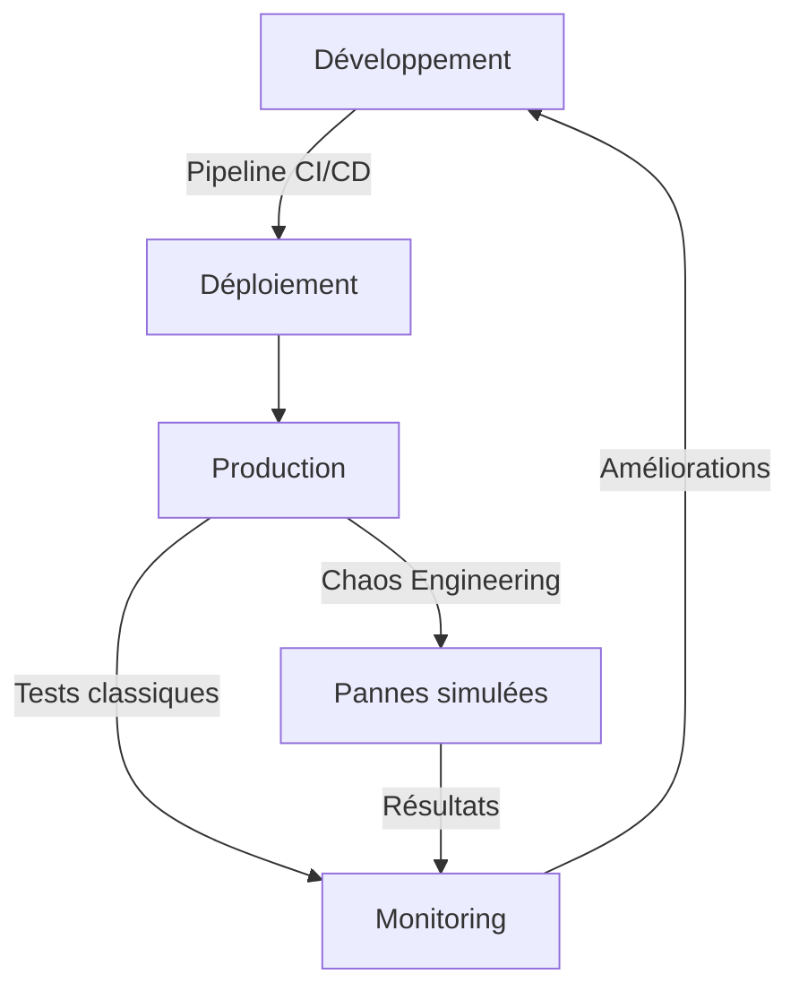
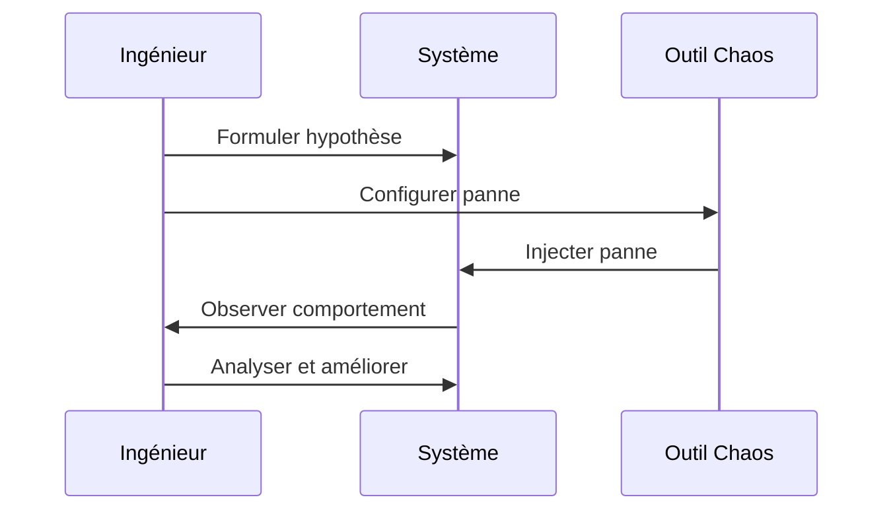
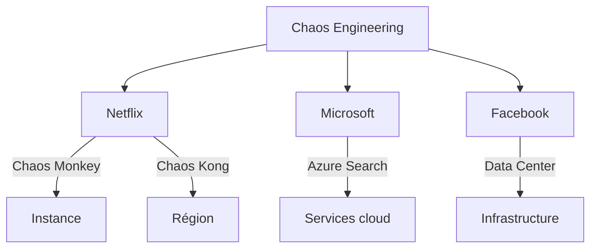
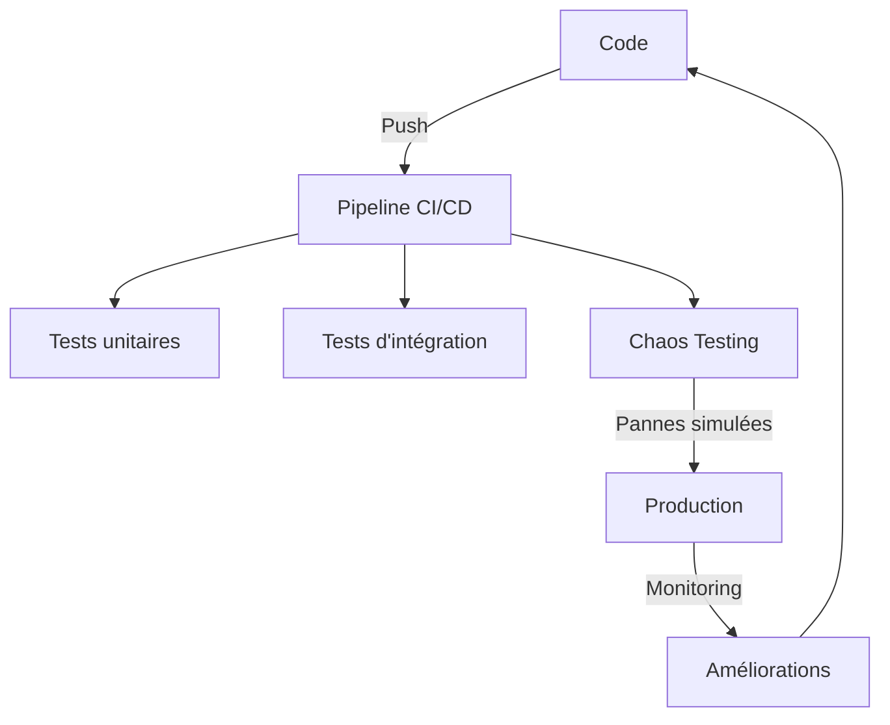

# 🧭 Chaos engineering

## ✅ 1. Introduction

🎯 **Thème choisi** : Fiabilité et résilience des systèmes dans un cadre DevOps à travers le **Chaos Engineering**

Dans les architectures DevOps modernes, l’accent est mis sur :
- **Rapidité** de mise en production (déploiements continus)
- **Scalabilité** via le cloud
- **Automatisation** des tests, du monitoring, etc.

Cependant, ces avantages s’accompagnent d’un défi majeur : les systèmes deviennent **massivement distribués** (microservices), augmentant le risque de pannes imprévisibles.

### Exemples de pannes possibles :
- Une instance EC2 tombe en panne
- Une configuration est mal propagée
- Un pic de trafic fait planter un service non critique

➡️ **Chaos Engineering** propose de tester la résilience des systèmes en **injectant volontairement des pannes** dans des conditions contrôlées et réalistes, souvent en production.

🚨 **Pourquoi c’est un challenge ?**
- La complexité des systèmes rend les tests classiques insuffisants
- Les déploiements fréquents en DevOps augmentent les risques de régression
- Une panne non anticipée peut avoir un impact critique (perte de service, de clients, d’image)
- Le test en production reste tabou dans de nombreuses organisations

### Diagramme : Flux DevOps avec Chaos Engineering

---

## ✅ 2. Présentation de l’article de départ

📌 **Référence**
- **Titre** : Chaos Engineering
- **Auteurs** : Équipe "Traffic and Chaos" de Netflix
- **Organisme** : Netflix, pionnier du DevOps à grande échelle
- **Type de publication** : Article scientifique – *IEEE Software*, vol. 33, n° 3, 2016
- **DOI** : [10.1109/MS.2016.60](https://doi.org/10.1109/MS.2016.60)

🧠 **Résumé des points principaux**
- **Définition** : Discipline expérimentale visant à garantir la résilience des systèmes distribués face à des conditions chaotiques (erreurs réseau, pannes, pics de charge, etc.)
- **Objectif** : Maintenir un système fonctionnel et stable (*steady state*)
- **Méthodologie en 4 principes** :
  1. Formuler une hypothèse sur le comportement attendu
  2. Injecter une panne réaliste (ex. : couper un service, ajouter de la latence)
  3. Réaliser l’expérience en production
  4. Automatiser les expériences pour les répéter régulièrement
- **Outils développés par Netflix** :
  - **Chaos Monkey** : Tue aléatoirement des instances
  - **Chaos Kong** : Simule la perte d’une région AWS entière
  - **FIT** : Tests d’échec entre services
- **Indicateur clé** : SPS (*Streams Per Second*), mesure simple de la santé du système

✅ **Pertinence de l’article**
- Rédigé par les pionniers du Chaos Engineering (Netflix)
- Propose une méthodologie structurée et applicable
- Contenu transposable aux environnements DevOps modernes (cloud, microservices)
- Fournit des outils concrets testés à grande échelle

### Diagramme : Workflow du Chaos Engineering

---

## ✅ 3. Recherches bibliographiques complémentaires

🔎 **Article 1 : Chaos Engineering chez Microsoft Azure**
- **Titre** : Inside Azure Search: Chaos Engineering
- **Source** : Blog officiel Microsoft Azure (2015)
- **Lien** : [azure.microsoft.com/blog/inside-azure-search-chaos-engineering](https://azure.microsoft.com/blog/inside-azure-search-chaos-engineering)
- **Résumé** :
  - Décrit l’application du Chaos Engineering dans les services Azure
  - Les pannes simulées révèlent des vulnérabilités inattendues, même dans des systèmes bien testés

🔎 **Article 2 : Test extrême de résilience chez Facebook**
- **Titre** : Facebook turned off entire data center to test resiliency
- **Source** : Data Center Knowledge (2014)
- **Lien** : [datacenterknowledge.com/facebook-test-resiliency](https://www.datacenterknowledge.com/facebook-test-resiliency)
- **Résumé** :
  - Facebook a coupé un datacenter entier pour tester sa résilience
  - Approche radicale mais efficace à grande échelle

🔄 **Apport par rapport à l’article de Netflix**
- **Microsoft** : Valide la méthode dans une infrastructure différente
- **Facebook** : Montre une application extrême et complémentaire
- **Conclusion** : Le Chaos Engineering est une discipline transversale, adoptée par plusieurs géants du numérique

### Diagramme : Comparaison des approches

---

## ✅ 4. Conclusion et mise en perspective

🔁 **Retour à la problématique**
Comment garantir la **stabilité des services** dans un contexte de changements fréquents et d’architectures complexes en DevOps ?

🧩 **Résumé**
- L’article de Netflix propose une méthode scientifique et outillée pour répondre à ce défi
- Les tests en production, les pannes contrôlées et l’automatisation sont au cœur de l’approche
- D’autres acteurs (Microsoft, Facebook) confirment la pertinence de la méthode

🔮 **Mise en perspective**
- ✅ **Applicabilité** : Idéal pour les entreprises avec une culture DevOps mature, des outils d’observabilité et une tolérance au risque contrôlé
- ⚠️ **Limites** :
  - Complexe à déployer dans des PME ou environnements non cloud
  - Nécessite une maturité en observabilité et automatisation
- 💡 **Pistes pour progresser** :
  - Utiliser des outils comme **Gremlin**, **LitmusChaos** (open-source) ou **AWS Fault Injection Simulator**
  - Intégrer le chaos testing dans les pipelines CI/CD
  - Partager les retours d’expérience pour enrichir la discipline

### Diagramme : Intégration dans CI/CD

